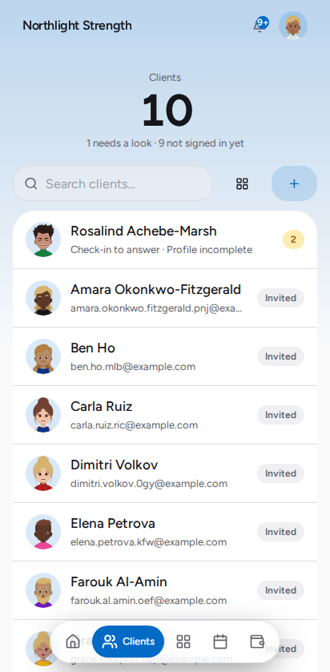
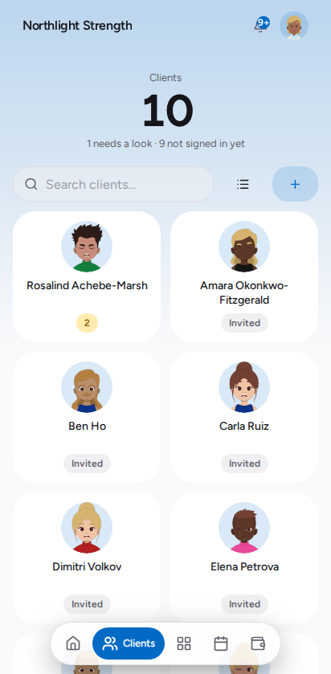
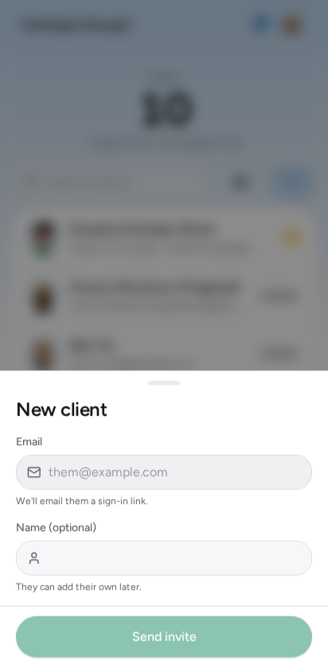

# Add a client

Everything in Kova hangs off a client record: their plan, their food log, their
progress, their package. This is how one gets made.

You need their **email address**. Nothing else is required — they fill in the
rest themselves the first time they sign in.

## Add them

1. Open **Clients** from the tab bar.
2. Tap **+** at the top right — it is labelled *Add client*.
3. Type their email address.
4. Tap **Send invite**.

*Clients — every person you coach, with anything that needs your attention
called out on their row. Someone who has not signed in yet shows as **Invited**.*

The two buttons beside the search switch between this list and a grid of faces.
Kova remembers which you prefer.

*The grid view — the same roster, for a studio that knows its people by sight.*

*New client — the cursor is already in the field, and Enter sends. A name is
optional; leave it blank and they add their own.*

## What happens next

Kova creates the client immediately and emails them a sign-in link branded as
your studio. The confirmation tells you which of those actually happened:

- **"We emailed a branded sign-in link"** — it went. They can sign in from the
  email.
- **"The invite email didn't go out"** — the record was still created, and the
  same link is on screen for you to copy. Send it however you like; it works
  identically.

Either way the link is worth having in the gym: they open it on their phone,
type the one-time code, and their account links to your studio automatically.
There is no password to create and nothing for them to set up.

Until they sign in for the first time, their row shows **Invited**.

## If it did not work

**"That email is already on your roster."**
They already have a client record here. Search for them on the Clients screen —
including under **Archived**, if a previous arrangement ended.

**"You've reached your plan's active client limit."**
Your plan has a ceiling on active clients. Archive someone you no longer coach
(their history is kept) or move up a plan under **Business**. Archived clients
do not count.

**The invite email did not go out.**
The message on the confirmation says why. The most common cause is that email
has not been switched on for the studio yet — an owner sets it under
**Settings → Email**. The client exists regardless, and the sign-in link on the
confirmation works right away, so nobody is blocked while that is sorted out.

**They say they never got it.**
Ask them to check spam, then send them the link directly: open the client, and
their sign-in link is on the **Manage** tab. The link does not expire — the code
they receive when they use it does, after 10 minutes.

## Related

- `invite-a-coach` — adding staff instead of clients
- `client-packages` — selling someone access after they are on the roster
