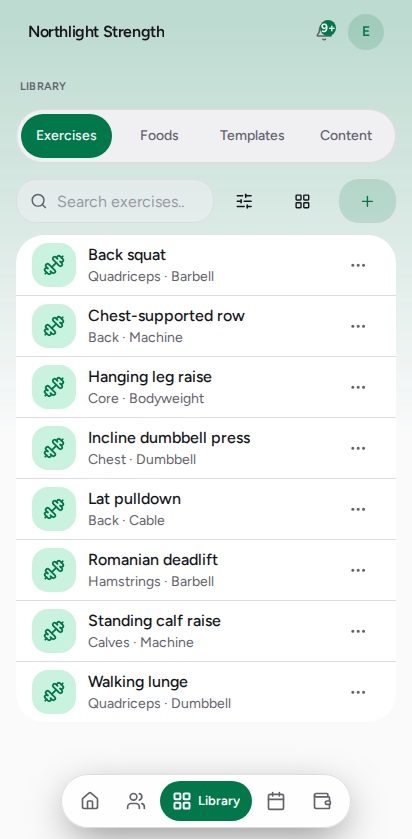

# Build your exercise library

Everything you put in a workout plan comes from here. A new studio starts empty
— you add movements as you use them, and the library fills up over a few weeks
of programming.

Open **Library** from the tab bar, then **Exercises**.

*Exercises — the muscle group and the equipment sit under each name, so you can
scan for "what can I do with a barbell" without opening anything.*

## Add a movement

1. Tap **+** at the top right.
2. Give it a **name** — the one you say out loud in the gym.
3. Pick the **muscle groups** it trains and the **equipment** it needs. Both
   feed the filters, so this is what makes the library browsable later.
4. Save.

Kova also ships a **starter library** an owner can install in one tap from
Settings. It is opt-in: a studio that programs its own way should not have to
delete two hundred movements it did not ask for.

## Find one

- **Search** matches the name.
- **Filter** narrows by muscle group and equipment. The button shows a number
  when something is on, and clearing it is one tap inside.
- The button beside it switches between the **list** and a **grid of thumbnails**.
  Kova remembers which you prefer.

A filter only appears when it can actually narrow things — a library where
everything is a barbell movement has no equipment filter to offer.

## Alternatives — the swap a client can make alone

Bind two movements together and a client can switch between them mid-session
with no approval and no message to you. It is what turns "the rack is busy" from
a skipped session into a logged one.

1. Tap **···** on the movement, then **Alternatives**.
2. Search for the movement you would accept instead, and tap it.

Binding works **both ways** — bind a goblet squat to a back squat and either one
offers the other. Bind what genuinely trains the same thing with different
equipment; a client swapping into something unsuitable is a swap you approved in
advance.

## Editing and archiving

- **Your own movements** open straight into the editor.
- **Starter-library movements** are shared across every studio, so editing one
  makes **a copy that belongs to you** and edits that. Yours from then on.
- **Archive** takes a movement out of your library and out of the pickers.
  Plans and logs that already use it keep working and keep showing the name —
  nothing you have programmed goes blank. Kova tells you how many plans and
  templates still reference it before you confirm.

There is no delete. A movement is referenced by every set anyone ever logged
against it, and removing it would rewrite their history.

## If it did not work

**I can't find a movement I know I added.**
Check the filter button for a number on it — a muscle-group or equipment filter
may be excluding it. The list says so when that is what happened.

**"Make a copy to edit" instead of "Edit".**
That movement came from the platform's starter library and is shared. Making the
copy is the fix; it is one tap and everything else stays the same.

**Archive is not offered.**
Same reason: it is not yours to archive. Starter-library movements are shared,
so hiding one for your studio is not something a single studio can do.

## Related

- `set-a-goal` — the targets a plan is built against
