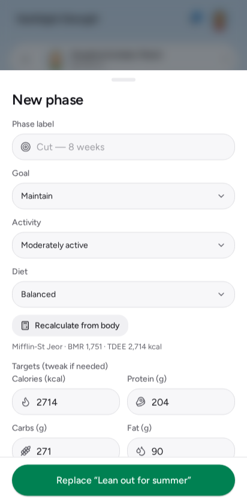
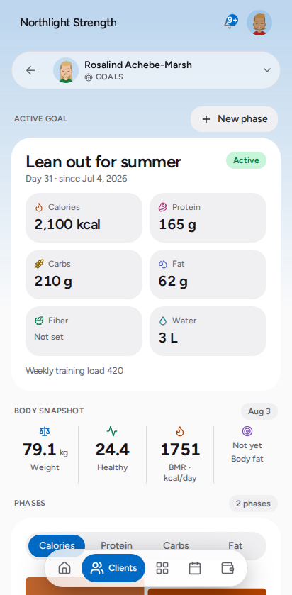

# Set a client's goal

A goal is what the client is held to day to day: calories, protein, carbs, fat,
fibre, water, and a weekly training-load target. Everything else in Kova reads
from it — the rings on their Today screen, their macro bar, adherence on their
Progress charts, and the report you share.

A client has **one goal in force at a time**. Setting a new one is called
starting a new **phase**; the old one is kept, with the dates it covered.

## Before you start

Kova calculates the targets from the client's body, so it needs four things on
their profile: **sex**, **date of birth**, **height** and **a recent weight**.

If any are missing, the goal screen says which — you can still type targets in
by hand, but nothing will be suggested for you.

## Set it

1. Open the client, then **Goals** from the section menu in the header.
2. Tap **New phase** (or **Set a goal** if they have never had one).
3. Give the phase a name — *Cut — 8 weeks*, *Off-season*, *Rehab block*. It is
   what you will see in their history later, so name it the way you would say it.
4. Check the three pickers: **Goal**, **Activity** and **Diet**. They start on
   whatever the client chose in their own preferences, and changing any of them
   recalculates the targets immediately.
5. Adjust any target you disagree with. Editing one stops Kova overwriting your
   numbers if you change a picker afterwards.
6. Set **Effective from** if the phase should start on a date other than today.
7. Tap **Replace "…"** — or **Set goal** for a first goal.

*New phase — the targets are already filled in from the client's body and the
formula you picked. The row at the top is what the client themselves asked for.*

The client sees the new targets straight away. **Past days keep the goal they
were logged under**, so changing a target today never rewrites last week's
adherence.

## What you see afterwards

*Goals — the goal in force at the top, the client's body under it, and every
phase they have been through as a series.*

- **The active goal** — the six targets, the weekly training-load target, and
  how many days into the phase they are.
- **Body snapshot** — the weight, BMI, BMR and body-fat the calculation used,
  with the date it was measured.
- **Phases** — pick a metric (calories, protein, carbs, fat) and the chart and
  the list both switch to it, so you can see the arc of the client's phases and
  the change from one to the next. Tap any phase to see it in full.

If the client's weight has moved a long way since the goal was set, a note at
the top says so. That is a prompt to start a new phase, not an error.

## Weekly training load

The **weekly training-load target** is separate from the nutrition targets: it
is the summed session load the client aims for each week, and it is what the
ring on their Train tab fills against. Leave it blank and Kova uses its default.

## If it did not work

**"Calculate or type a calorie target to save."**
The save button stays disabled until there is a calorie target. Either fill in
the client's profile so Kova can calculate one, or type it in yourself.

**The targets did not change when I changed the Goal picker.**
You edited a target by hand at some point, so Kova stopped overwriting your
numbers. Tap **Recalculate from body** to go back to the calculated set.

**"Add sex, height… to the client's profile."**
Those fields are on the client's own profile and preferences, and the client can
fill them in themselves — ask them, or open **Manage → the client's profile** and
add what you know. You can still type the targets in without them.

**I set the wrong targets.**
Start another phase with the right ones. There is no edit: a goal is a record of
what the client was held to, and rewriting it would rewrite their history. If
the wrong phase only lasted an hour, set the new one's **Effective from** to the
same date and the wrong one takes up no days.

## Related

- `add-a-client` — getting someone onto the roster first
- `client-packages` — selling access, which is separate from their goal
